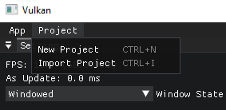
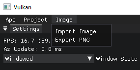
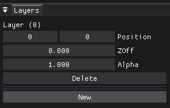
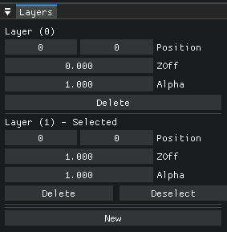
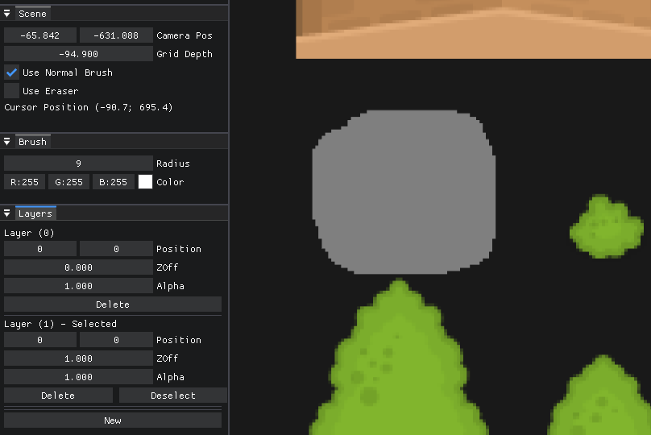
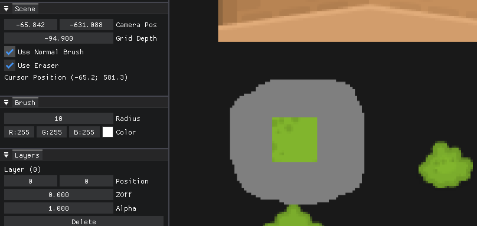
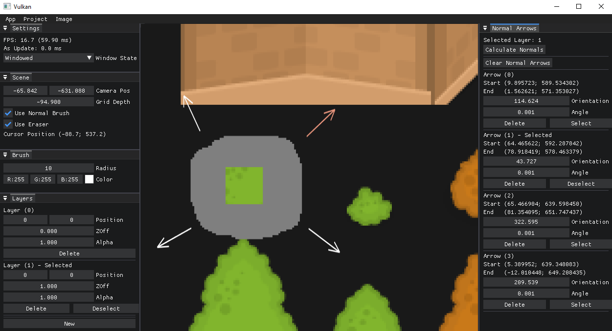
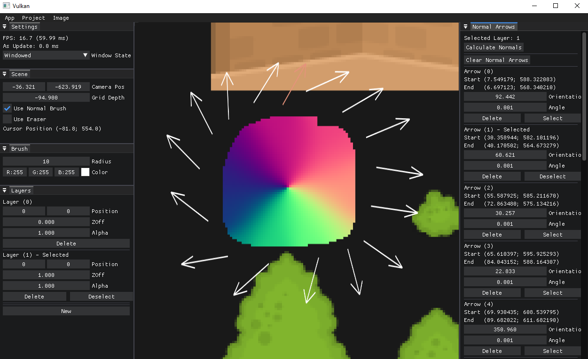

# NormalMaker

An application to create normal map textures easily

## Build (MSVS)

Run this command to create the solution files:

```bash
scripts/Win-GenProjects.bat
```

## Usage

### Project

Import or create a project via the "Project" tab in the tab menu.




### Image

Then import a base image as layer 0, you will calculate the normals using that layer.



### Layers

A layer will be added to the layer list whose position, z-order and alpha can be changed.



With the New button you will add a normal layer on which you can calculate the normal vectors.
With the select button you select that layer to paint "Null Vectors" on it.



### Paint

By selecting "Use Normal Brush" you can paint the "Null Vectors" on the selected layer, otherwise you can paint specific colors by deselecting it.



You can also erase pixels in that layer by selecting "Use Eraser".



### Normal

By clicking on the viewport with the right mouse button and holding it down you can create vectors and orient them where you want.
Each vector can be selected, via the "Normal Arrows" window, and will be highlighted on the screen.
Furthermore, each vector has the possibility, again via the "Normal Arrows" window, to be correct by direction and you can point it in directions towards the z axis by changing the "Angle" value which by default is 0, which is equivalent to parallel to the image.
You can take it up to 90°, which is perpendicular to the image.



With a layer selected, if you press the "Calculate Normals" button, the corresponding normal vectors for each pixel, with the value "Null Vector", will be calculated and normal arrow.


